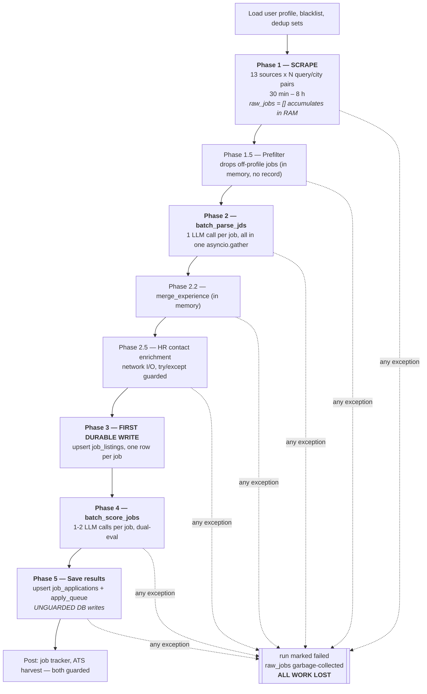
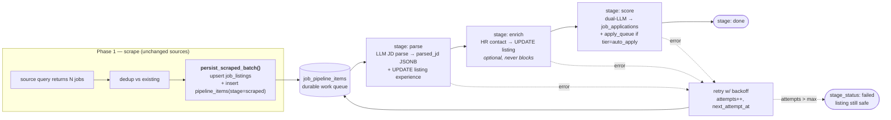

# Discovery Pipeline Durability — Design

> **Status:** IMPLEMENTED (2026-08-02) — approved and shipped across increments 0–6.
> **Problem:** a failure in any post-scrape stage discards 30 min – 8 h of scraping work.
> **Goal:** no scraped job is ever lost because a later processing stage fails. Every stage independent, recoverable, resumable.
> **Companion doc:** [`PIPELINE_DURABILITY_IMPLEMENTATION.md`](PIPELINE_DURABILITY_IMPLEMENTATION.md) — increments, migration DDL, tests, rollback.
>
> **Action required:** run `database/16_pipeline_durability.sql` in the Supabase SQL editor.
> Until it is applied the code detects the missing table and falls back to the previous
> in-memory pipeline — scrape output is still saved immediately, but the AI stages are
> not yet resumable.

---

## 1. The incident this design responds to

From the Search Activity page, last manual India run:

| Field | Value |
|---|---|
| Status | **failed** |
| Duration | **467 m 9 s** (7 h 47 m) |
| Sources | 13 / 13 completed |
| Jobs found | **144** |
| AI evaluated | 108 |
| Matched | **0** |
| Auto-queued | **0** |
| Error | `[Errno 8] nodename nor servname provided, or not known` |

`[Errno 8]` is a `socket.gaierror` — **DNS resolution failed**. Some HTTP call (Supabase REST or an LLM provider) could not resolve its hostname, most likely a transient network drop during a run that spanned nearly eight hours.

The run reached scoring — `evaluated: 108` is only set after listings are stored ([`job_discovery.py:480`](../apps/api/workers/job_discovery.py#L480)) — then died, and **every one of the 108 evaluations plus all 144 scraped jobs disappeared from the user's view**.

Two secondary observations from the same screenshot:

- The stepper shows the ✗ on **step 1 "Initializing"**, which is wrong — the run actually died at step 4/5. `finish_run` overwrites `phase` with the status string (`"failed"`, [`discovery_progress.py:205`](../apps/api/services/discovery_progress.py#L205)), the frontend does `STEPS.findIndex(s => s.key === run.phase)` ([`activity-client.tsx:128`](../apps/web/src/components/activity/activity-client.tsx#L128)) → `-1` → nothing renders as reached. The UI cannot tell you where it broke.
- 467 minutes is itself a symptom: the pipeline holds everything in memory for the entire run, so the exposure window to any transient fault is the *whole* run length.

---

## 2. Current architecture

### 2.1 Entry points

| Trigger | Path | Notes |
|---|---|---|
| Manual — "Discover Jobs" button | `POST /jobs/discover` → `BackgroundTasks` → `run_discovery_for_user` | [`jobs.py:183`](../apps/api/routers/jobs.py#L183) |
| Scheduled cron | APScheduler `_run_discovery_all_users` (every `DISCOVERY_INTERVAL_HOURS`) | opt-in via `DISCOVERY_SCHEDULER_ENABLED`, [`scheduler.py:213`](../apps/api/scheduler.py#L213) |

Both land in [`run_discovery_for_user`](../apps/api/workers/job_discovery.py#L266), which wraps `asyncio.run(_discover_for_user_async(...))` in a single try/except. **That try/except is the only failure boundary for the entire pipeline.**

### 2.2 The pipeline as it exists today

### 2.3 Durability timeline — what survives a crash at time *t*

| Elapsed | Stage | Scraped jobs durable? | User-visible? |
|---|---|---|---|
| 0 – 470 min | Scraping (Phase 1) | ❌ RAM only | ❌ |
| +0–5 min | Prefilter (1.5) | ❌ | ❌ |
| +5–40 min | JD parsing (2) | ❌ | ❌ |
| +40–45 min | Experience merge (2.2) | ❌ | ❌ |
| +45–55 min | HR enrichment (2.5) | ❌ | ❌ |
| **+55 min** | **Store listings (3)** | ✅ `job_listings` | ❌ *(orphaned — no application row)* |
| +55–90 min | Scoring (4) | ✅ listings only | ❌ |
| +90 min → | Save matches (5) | ✅ | ✅ per row, as the loop advances |

The window in which a fault destroys **100 %** of the run is everything up to Phase 3 — i.e. the long part. And even after Phase 3, the rows are invisible: the UI reads the `application_details` view, which is `job_applications JOIN job_listings` ([`schema.sql:375`](../database/schema.sql#L375)). A listing with no application row shows up nowhere.

### 2.4 Where state lives

| State | Storage | Survives process restart? |
|---|---|---|
| `raw_jobs`, `parsed_jds`, `scores` | Python lists in the worker thread | ❌ |
| Run progress / event log | module-level dict, `services/discovery_progress.py` | ❌ |
| Run history summary | `apps/api/data/discovery_runs.json` — **written only in `finish_run`** | ❌ if killed mid-run |
| Telemetry run record | sqlite `data/telemetry.db` — **written only in `finish_run`** | ❌ if killed mid-run |
| Job listings | Supabase `job_listings` | ✅ from Phase 3 |
| Match records | Supabase `job_applications` | ✅ from Phase 5, row by row |

---

## 3. Identified failure points

Ranked by blast radius. "Total loss" = all 144 scraped jobs.

| # | Failure | Where | Blast radius | Root cause |
|---|---|---|---|---|
| **F1** | Any exception between scrape start and Phase 3 | [`job_discovery.py:340–473`](../apps/api/workers/job_discovery.py#L340) | **Total loss** | Scraped output is never persisted before the AI stages run |
| **F2** | `job_applications` upsert / `apply_queue` insert raises | [`job_discovery.py:517`](../apps/api/workers/job_discovery.py#L517), [`:527`](../apps/api/workers/job_discovery.py#L527), [`:532`](../apps/api/workers/job_discovery.py#L532) | All *remaining* matches in the loop | **No try/except.** One transient DNS/5xx kills the loop for every job after it. **This is what happened in the incident.** |
| **F3** | Process restart (crash, deploy, `uvicorn --reload` on any file save — see [`Makefile:16`](../Makefile)) | whole worker | **Total loss + no run record** | Work lives in a `BackgroundTasks` thread with no durable checkpoint; the run summary is only flushed at `finish_run`, so an interrupted run vanishes from history entirely |
| **F4** | Prefilter drops jobs before any persistence | [`job_discovery.py:425–433`](../apps/api/workers/job_discovery.py#L425) | 36 jobs in the incident | A recall-first heuristic is the *last* word on a job that was never recorded. A tuning mistake is unrecoverable and invisible |
| **F5** | `_upsert_job_listing` returns `None` (missing column, bad enum, network) | [`job_discovery.py:594–643`](../apps/api/workers/job_discovery.py#L594) | 1 job each, silent | Failure returns `None`; the job is excluded from `valid_indices` and dropped with no record and no retry |
| **F6** | Listings stored, applications not → orphan rows | Phases 3 vs 5 | Wasted work, repeated | Dedup sets are built from `job_applications` ([`:327`](../apps/api/workers/job_discovery.py#L327)), so orphaned listings are re-scraped, re-parsed and re-scored on every subsequent run |
| **F7** | No per-job stage state anywhere | whole worker | No resume possible | A failed run can only be retried from zero — including the 8 h of scraping |
| **F8** | Whole-batch `asyncio.gather` for parse and score | [`job_analysis.py:208`](../apps/api/services/ai/job_analysis.py#L208), [`:240`](../apps/api/services/ai/job_analysis.py#L240) | Batch-wide | Per-job errors are swallowed (good), but *no* result is committed until the entire batch returns; 143 successful parses are lost if job 144 takes the process down |
| **F9** | Failed phase misreported in UI | [`discovery_progress.py:205`](../apps/api/services/discovery_progress.py#L205) + [`activity-client.tsx:128`](../apps/web/src/components/activity/activity-client.tsx#L128) | Diagnosis | `phase` is overwritten with `"failed"`, so the stepper shows the failure at "Initializing" regardless of where it really happened |
| **F10** | No claim/lease or idempotency on work items | — | Duplicate LLM spend | Concurrent runs (manual + cron, or two processes) would re-do the same jobs. Guarded only by an in-memory `active_run_id` check |
| **F11** | Budget exhaustion mid-batch is indistinguishable from a scoring failure | [`provider.py:174`](../apps/api/services/ai/provider.py#L174), [`job_analysis.py:247`](../apps/api/services/ai/job_analysis.py#L247) | Silent zero-scores | `BudgetExceededError` → `_empty_score()` → the job is written with `match_score 0`, `tier archived` and looks permanently evaluated. It will never be re-scored when budget resets |

---

## 4. Design goals

1. **Scrape output is durable within seconds of leaving the scraper.** Not after the phase, not after the AI — per query batch.
2. **Every downstream stage reads from and writes to the database**, never a long-lived in-process list.
3. **Every job carries its own stage + attempt state**, so any subset can be retried independently.
4. **A stage failure affects one job, not the batch.** No unguarded write may abort a loop.
5. **A process restart loses at most the in-flight batch**, and the pipeline resumes automatically without user action.
6. **Prefiltered / failed / budget-skipped jobs are recorded, not vanished** — auditable and revivable.
7. **No change to the user-visible outcome** on the happy path: same matches, same auto-apply behaviour, same Search Activity page (plus better failure reporting).

### Non-goals

- Introducing Redis/Celery/RQ. The project is deliberately a single `uvicorn` process ([README](../README.md)); the design stays in Postgres + APScheduler.
- Multi-worker horizontal scale. The lease mechanism is designed so it *could* work, but single-process remains the target.
- Rewriting the scrapers or the LLM provider layer.

---

## 5. Proposed architecture — persist-then-process

### 5.1 The core inversion

> Today: `scrape → AI → save`.
> Proposed: `scrape → **save** → AI (per stage, per item, resumable) → save results`.

`job_listings` needs **nothing from the AI** — `title`, `company`, `jd_text`, `source_platform`, `source_url` all come straight from the scraper. Everything the AI produces is either an *enrichment of the listing* (experience fields, HR contact) applied by `UPDATE`, or a *per-user match record* (`job_applications`). So the listing row can be written the moment a query returns.

The queue is drained twice:

- **Inline**, by the discovery run itself, immediately after scraping — so the happy path feels identical to today (same run, same live progress, same "matched" count at the end).
- **By an APScheduler job** every few minutes — which is what makes it *resumable*: whatever the run left behind, or a restart interrupted, gets finished without anyone pressing a button.

### 5.2 New table: `job_pipeline_items`

One row per (user, listing) discovered — the durable unit of work.

| Column | Type | Purpose |
|---|---|---|
| `id` | UUID PK | |
| `user_id` | UUID FK → users | owner of the eventual match record |
| `run_id` | TEXT | the discovery run that found it (matches `discovery_progress` run ids) |
| `job_listing_id` | UUID FK → job_listings | the durable listing, written before this row |
| `source_platform` | TEXT | telemetry / diagnostics without a join |
| `stage` | TEXT | `scraped` → `parsed` → `enriched` → `scored` → `done`; plus terminal `prefiltered` |
| `stage_status` | TEXT | `pending` \| `processing` \| `failed` |
| `attempts` | INT | per-stage attempt counter, reset on stage advance |
| `max_attempts` | INT | default from config (3) |
| `last_error` | TEXT | truncated exception text for the UI |
| `next_attempt_at` | TIMESTAMPTZ | exponential backoff gate |
| `claimed_at` | TIMESTAMPTZ | lease timestamp; stale claims are reaped |
| `parsed_jd` | JSONB | **the parse stage's output** — so scoring never re-pays for parsing |
| `created_at` / `updated_at` | TIMESTAMPTZ | |

Key indexes: `UNIQUE (user_id, job_listing_id)` (idempotency), and `(stage, stage_status, next_attempt_at)` (the drain query).

Full DDL is in the implementation doc, §2.

### 5.3 Stage semantics

| Stage | Reads | Writes | On failure |
|---|---|---|---|
| `scraped` | — | *(created by the scraper checkpoint)* | n/a — already durable |
| `parse` | `job_listings.jd_text` | `parsed_jd` JSONB; `UPDATE job_listings` experience fields | retry ×3 w/ backoff → `failed`; listing keeps scraper-provided values |
| `enrich` | listing company/urls | `UPDATE job_listings` hr_* columns | **never retried, never blocks** — advances anyway (matches today's non-fatal behaviour) |
| `score` | `parsed_jd` + `jd_text` + user profile | `job_applications` upsert, `apply_queue` insert | retry ×3 w/ backoff → `failed` |
| `done` | — | — | terminal |
| `prefiltered` | — | — | terminal, but the listing row exists and the item is revivable by a single UPDATE |

Rules that make this safe:

- **Every per-item DB write is individually try/except'd.** An error marks *that item* failed and continues the batch. This alone fixes F2.
- **Stage advance is a single atomic UPDATE** after the stage's own writes succeed. A crash between the write and the advance re-runs the stage — so every stage must be **idempotent**, which they naturally are: `job_listings` upsert is on a unique `source_url`; `job_applications` upsert is on `(user_id, job_listing_id)`; the only non-idempotent write is `apply_queue.insert`, which gets an existence check first.
- **Claim before work**: `stage_status='processing'`, `claimed_at=now()`. A reaper releases claims older than `PIPELINE_CLAIM_TIMEOUT_MINUTES` back to `pending` — the same pattern already used by `recover_stuck_applications` ([`scheduler.py:195`](../apps/api/scheduler.py#L195)).
- **Backoff**: `next_attempt_at = now() + 2^attempts minutes` (2, 4, 8). Transient DNS/5xx faults self-heal on the next drain instead of killing a run.
- **Budget-aware**: a `BudgetExceededError` sets `next_attempt_at` to the next UTC midnight and does **not** consume an attempt — fixing F11 (today those jobs get silently written as `score 0 / archived` forever).

### 5.4 Dedup correction (F6)

`existing_urls` / `existing_fps` are currently built only from `job_applications`. They will additionally include listings referenced by this user's `job_pipeline_items`, so a job already staged is not re-scraped and re-processed by the next run.

### 5.5 Prefilter becomes a recorded decision (F4)

The prefilter still runs — protecting the LLM budget is exactly right — but *after* the listing is persisted. Off-profile jobs get an item row at `stage='prefiltered'`. Cost: `job_listings` grows by whatever the prefilter would have dropped (≈25 % on this run). Benefit: nothing scraped is ever untraceable, and a prefilter regression can be replayed with one SQL UPDATE instead of another 8-hour scrape. See decision **D1** below.

### 5.6 Run-state durability (F3, F9)

- Flush the run summary to `data/discovery_runs.json` on **every phase transition**, not only at `finish_run`, so an interrupted run leaves a record instead of vanishing.
- Keep `phase` as the last *real* phase and add `failed_phase` for the failure marker; update the frontend stepper to render the ✗ on the phase that actually failed.
- On startup, mark any run still `running` in the history file as `interrupted` — its items are already safe in the queue and the drain worker will finish them.

### 5.7 What the user sees

| | Today | After |
|---|---|---|
| Happy path | 144 scraped → 108 matched at the end | identical |
| Transient network blip at scoring | **0 jobs, 8 h wasted** | run reports partial; drain worker completes the rest within minutes |
| Server restart mid-run | **0 jobs, no run record** | listings + queue intact; drain resumes; run shows `interrupted` |
| Failure location | always shows "Initializing ✗" | shows the true failing stage + per-item error text |
| Retry cost after failure | full re-scrape (30 min – 8 h) | zero re-scrape; only the failed stage re-runs |
| New in Search Activity | — | queue panel: pending / processing / failed by stage, with a **Retry failed** action |

---

## 6. Decisions needed before implementation

All resolved 2026-08-02 (decisions marked ✅ are what shipped).

| ID | Decision | Outcome |
|---|---|---|
| **D1** | Persist jobs the prefilter rejects? | ✅ **Persist**, tagged `stage='prefiltered'`. The literal reading of "no scraped job is ever lost", and it makes prefilter tuning safe — `job_pipeline.revive_prefiltered()` replays them without a re-scrape. Costs ≈25 % more `job_listings` rows; opt out with `PIPELINE_PERSIST_PREFILTERED=false` |
| **D2** | Show not-yet-scored jobs in the UI? | ✅ **No** — they appear once scored. The data is already safe, and the new queue panel reports what is still in flight. Surfacing unscored jobs needs `application_status` enum changes; deferred |
| **D3** | Separate queue table vs. a new `job_applications.status` value | ✅ **New `job_pipeline_items` table** — reusing `job_applications` would need a Postgres enum migration, make `match_tier NOT NULL` awkward, and pollute the user's pipeline and analytics with unscored rows |
| **D4** | Inline drain during the run, or queue-only? | ✅ **Both** — the run drains its own queue inline (identical live UX), and the 5-minute scheduled drain is the safety net |
| **D5** | Backfill the 108 orphaned listings from the failed run? | ✅ **Backfill script** — `scripts/backfill_orphan_listings.py`, dry-run by default |

---

## 7. Risks and mitigations

| Risk | Mitigation |
|---|---|
| More DB round-trips during scraping (one upsert per job, earlier) | Same total upsert count as today — only moved earlier. Batched per query result (typically 5–30 rows), not per job |
| `job_listings` grows faster (D1) | Bounded by scrape volume, which is unchanged; existing cleanup SQL prunes. Revisit if the Supabase project approaches its storage tier |
| Idempotency bug → duplicate applications | `UNIQUE (user_id, job_listing_id)` on both `job_applications` and `job_pipeline_items`; `apply_queue` gets an existence check before insert |
| Drain worker and an inline run process the same item | Claim/lease with `stage_status='processing'` + stale-claim reaper |
| Regression in the happy path | Increment 0 ships the pure-safety fix alone; each later increment is independently revertable; new unit tests cover stage transitions and fault injection |
| Migration not applied on the live DB | Same defensive pattern already used across this codebase: the persistence layer degrades to today's in-memory flow if `job_pipeline_items` is missing, and logs a one-line "run migration 16" warning |

---

## 8. Success criteria

1. Kill `uvicorn -9` at any point after the first source finishes → every job scraped so far exists in `job_listings` with a pipeline item, and the pipeline completes on its own after restart. **No re-scraping.**
2. Force a DNS failure during scoring → affected items go `failed` with `last_error`; all other items complete; the run reports partial success and the failed items succeed on the next drain.
3. A full happy-path run produces the same match count as the current implementation.
4. The Search Activity stepper marks the ✗ on the stage that actually failed.
5. Re-running discovery immediately after a partial failure does not re-scrape jobs already staged.
