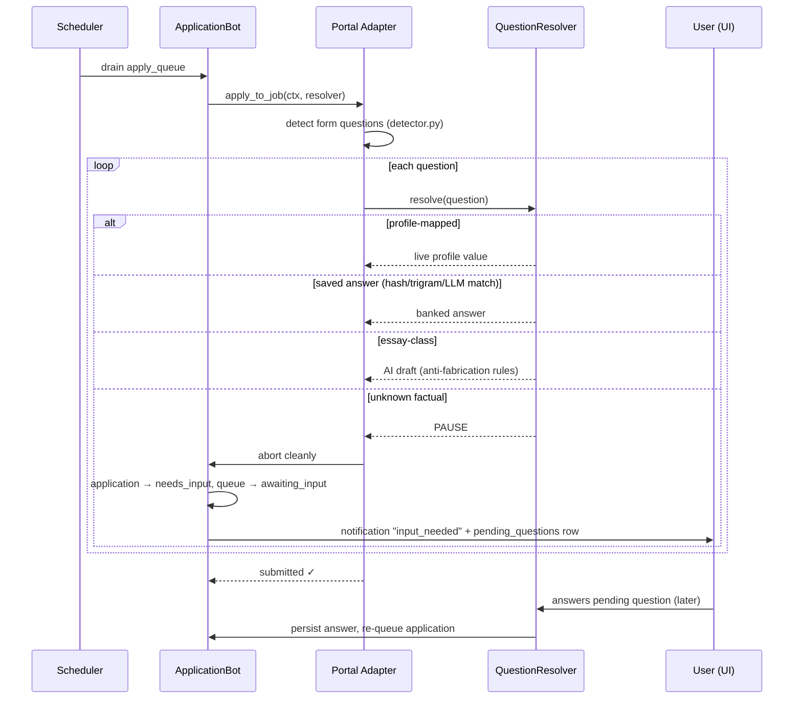

# Multi-Portal Integration Roadmap

> **Status:** PLANNING — awaiting review/approval before implementation.
> **Scope:** 20 job portals · automated apply where feasible · universal Answer Bank (question detection → auto-fill → persist → user-managed).
> **Date:** 2026-07-03 · reflects the post-refactor codebase (APScheduler, `services/ai/` package, session-based auth).

---

## 1. Executive Summary

The platform already covers **12 of the 20 requested portals** at the discovery level and has full auto-apply on 2 (LinkedIn, Naukri). The two structural gaps this roadmap closes are:

1. **The Answer Bank** — a persistent, user-managed store of application-question answers. Today, screening answers are drafted per-application and thrown away (`submitted_responses` JSONB is per-application only). The new system detects every question a portal asks, auto-fills from profile or previously saved answers, pauses the application when a question is unknown (never guesses — consistent with the existing anti-fabrication rules), and lets the user view/edit/delete every saved answer.
2. **A capability-tiered connector model** — every portal declares what it supports (search / details / auto-apply / resume upload / question detection), the UI surfaces the tier per job ("Auto", "Assisted", "View only"), and portals that can't be automated still deliver value as display + link-out sources.

Estimated total effort for Phases 0–4: **≈ 45–60 dev-days**, structured so each phase ships independent user value.

---

## 2. Current-State Review & Gap Analysis

### 2.1 What is already implemented ✅

| Area | Evidence |
|---|---|
| Discovery from 19 sources, region-aware registry, keyed-source auto-skip | `workers/job_discovery.py` `SOURCE_REGISTRY` |
| Dual-LLM scoring (Groq+NVIDIA), double-eval ≥70, tiering (auto_apply/recommended/watchlist) | `services/ai/job_analysis.py` |
| Auto-apply queue: retries (max 3), per-platform daily caps, randomized human delays | `scheduler.py`, `workers/application_bot.py`, `services/rate_limiter.py` |
| Session-based portal auth (Fernet-encrypted cookies, handshake login, health checks, audit log) | `services/sessions/` — adapters: **linkedin, naukri** |
| Assisted-apply flow: prepare → validate profile (8 required fields, blocks instead of guessing) → draft answers → user opens/confirms | `services/application_service.py`, `routers/applications.py` |
| Reusable Application Profile (13 fields incl. work_authorization, notice period, salary, per-skill years) | `routers/profile.py`, migration 03 |
| Per-application audit trail (`application_events`), status history trigger | migration 03, `schema.sql` |
| 3-level dedup (unique `source_url`, unique user+listing, pre-scrape URL set) | schema + `job_discovery.py` |
| Excel job tracker (≥50% match), recency bucketing, cover letters, interview prep, follow-ups | `services/job_tracker.py`, `services/ranking.py`, `services/ai/` |

### 2.2 What is partial 🟡

| Feature | What exists | What's missing |
|---|---|---|
| Question detection | LinkedIn/Naukri adapters answer questions via a `screening_answerer` LLM callback; 5 common questions pre-drafted in assisted flow | No DOM-level detection of *arbitrary* form questions; no schema; no persistence |
| Answer reuse | `submitted_responses` JSONB per application | Never read back; no cross-application reuse; no user-facing CRUD |
| Portal coverage | 12/20 portals have scrapers | 6 scrapers have no session adapter → discovery only; 8 portals absent |
| Resume in applies | Primary resume downloaded & attached where adapter supports it | No per-portal declaration of resume-upload capability; no tailored-resume selection at apply time |

### 2.3 What is missing ❌ (carried into this roadmap)

- **Answer Bank** (this document's Phase 1 — the user-facing core feature).
- **Session adapters** for Instahyre, Cutshort, Foundit, Hirist (+ Indeed/Wellfound assisted mode).
- **8 new portals**: Hirect, iimjobs, Freshersworld, TimesJobs, Shine, Google for Jobs, YC Work at a Startup, FlexJobs (+ Angel.co alias).
- **Stale-listing validation** — `job_listings.is_active` is never updated; no dismiss/remove control (pre-existing debt, folded into Phase 0).
- **Stuck-state recovery** — `applying` rows orphaned after a crash (Phase 0).
- **Per-user discovery gating** — scheduler discovers for all users regardless of toggle (Phase 0).
- **Docs refresh** — README.md and PROJECT_DOCUMENTATION.md still describe Celery/Redis (Phase 0).
- Smaller debt: unencrypted legacy `platform_credentials` retirement, analytics snapshots, confirmation screenshots, `.in_()` batching (Phases 0/5).

---

## 3. Portal Capability Matrix (all 20)

**Tiers** — **A**: full auto-apply · **B**: assisted (prefill + user confirms in-app) · **C**: discovery/display + link-out only.

| # | Portal | Today | Target | Auth | Search | Details | Auto-apply | Resume upload | Questions | Anti-bot risk |
|---|--------|-------|--------|------|--------|---------|-----------|---------------|-----------|----------------|
| 1 | LinkedIn | Scraper + adapter | **A** (Easy Apply) / B (external) | Session handshake ✅ | Playwright (+ JSearch backup) | Scrape | Easy Apply modal only | Yes (in modal) | Modal steps: select/radio/numeric/text | **High** — account restriction risk; keep 40/day cap |
| 2 | Naukri | Scraper + adapter | **A** | Session ✅ (14d) | Playwright + internal JSON API | JSON/scrape | Native 1-click apply | Profile-hosted (sync note §6.4) | Chatbot questionnaire (RecruiterQ-style) | Medium — 80/day cap |
| 3 | Instahyre | Scraper only | **A** | Session (new adapter) | Authenticated JSON API (Angular SPA) | JSON | 1-click "Apply" | Profile-hosted | Rare | Low-medium |
| 4 | Cutshort | Scraper only | **A** | Session (new adapter) | Internal API | JSON/scrape | 1-click + optional note | Profile-hosted | "Why you" note (AI-draft, essay class); **assessments → pause, never automate** | Medium |
| 5 | Wellfound | Scraper only | **B** | Session (new adapter) | Algolia-backed, authenticated | Scrape/JSON | Apply + note to founder — *automatable but risky* → assisted | Profile-hosted | Founder note (essay class) | **High** (PerimeterX) |
| 6 | Indeed India | Scraper (brittle) | **B** | Session (optional) | **JSearch API (already integrated) as primary**; scraper backup | JSearch/scrape | Indeed Apply automation = high risk (hCaptcha) → assisted prefill | Yes (Indeed Apply) | Indeed Apply questionnaire | **High** (Cloudflare + hCaptcha) |
| 7 | Foundit | Scraper only | **A** | Session (new adapter) | Internal JSON search API | JSON | 1-click from profile | Profile-hosted | Occasional | Medium |
| 8 | Hirect | — | **C / excluded** | n/a | Mobile-app-only chat hiring; no candidate web app | Timeboxed 1-day spike; likely deep-link only | No | No | n/a | n/a — platform model incompatible |
| 9 | Hirist | Scraper only | **A** | Session (new adapter) | Scrape/JSON | Scrape | 1-click + occasional questionnaire | Profile-hosted | Occasional | Low-medium |
| 10 | iimjobs | — NEW | **A** | Session | Same platform family as Hirist (both Info Edge) → **clone Hirist adapter, different domain config** | Scrape | 1-click | Profile-hosted | Occasional | Low-medium |
| 11 | Freshersworld | — NEW | **A** (native) / C (redirect jobs) | Session | Server-rendered scrape — easy | Scrape | 1-click on native jobs; many redirect to employers | Yes | Simple forms | Low. Note: fresher-level roles — gate by `experience_years` or opt-in |
| 12 | TimesJobs | — NEW | **A** | Session | Server-rendered scrape — easy (+RSS) | Scrape | 1-click apply | Profile-hosted | Simple | Low |
| 13 | Shine.com | — NEW | **A** | Session | Scrape + internal JSON | Scrape/JSON | 1-click from profile | Profile-hosted | Occasional | Medium |
| 14 | Glassdoor | Scraper (global) | **C** | None | Scrape (brittle) | Scrape | No — applies proxy to Indeed (same parent) or external ATS | No | n/a | **High** (Cloudflare) — display + link-out only |
| 15 | Google for Jobs | — | **C via JSearch** | n/a | **Already covered: JSearch (RapidAPI) sources Google for Jobs** | Via JSearch | No (aggregator, links to origin portal) | No | n/a | SERP scraping = ToS risk; use the licensed API path we have |
| 16 | YC Work at a Startup | — NEW | **B → A** | Session (YC account) | Public Algolia JSON | JSON | Simple application/intro form — automatable | Profile-hosted | Intro note (essay class) | Low; low volume, high quality |
| 17 | Remote OK | API ✅ | **C** (+ generic-portal fallback) | None | API ✅ | API ✅ | External `apply_url` only | Via generic portal filler | Whatever the external form has | Low |
| 18 | We Work Remotely | Scraper ✅ | **C** | None | Scrape ✅ | Scrape ✅ | External links only | Via generic portal filler | External | Low |
| 19 | FlexJobs | — NEW | **C (optional)** | User's paid session | ToS prohibits scraping; with user's own session: fetch for personal display | Session fetch | No — applies always link out | No | n/a | Paywall; **lowest priority; ship only if user subscribes** |
| 20 | Angel.co | — | alias | 301-redirects to Wellfound → **registry alias + URL normalization in dedup** | — | — | — | — | — | — |

**Cross-cutting reality check (link-out jobs):** a large share of B/C-tier applies land on a handful of ATSes (Greenhouse, Lever, Ashby, Workday). Building **4 generic ATS adapters** (Phase 5) converts most "View only" jobs into auto/assisted applies — higher ROI than any single remaining portal.

---

## 4. New Core Feature — The Answer Bank

### 4.1 Behavior (as specified)

1. During any apply (auto or assisted), the **Question Detection Engine** extracts every form question (standard + custom).
2. Each question is resolved in order: **profile field → saved answer → (essay-class only) AI draft → PAUSE**.
3. Factual questions with no known answer **pause the application** (`needs_input`), notify the user, and appear in a "Questions waiting" inbox. Nothing is ever guessed (consistent with the existing `NEEDS_INFO` rule and the no-dummy-data policy).
4. The user's reply is **persisted** and auto-fills every future occurrence across all portals.
5. A dedicated **Answers page** lets the user view, search, edit, and delete every saved answer at any time.

### 4.2 Question taxonomy

| Class | Examples | Resolution | Banked? |
|---|---|---|---|
| **Profile-mapped** | notice period, expected CTC, work authorization, total experience, relocation, contact info | Live-read from `users` via a mapping table (single source of truth — edits propagate) | No (mapping only) |
| **Factual custom** | "Years of experience with Kafka?", "Current CTC?", "Do you have a PMP cert?" | Saved answer, else PAUSE and ask user | **Yes** |
| **Essay/opinion** | "Why this company?", founder note, cover note | AI-drafted per-job (job-specific, so not banked); user-approved in assisted mode | No |
| **Un-automatable** | Assessments, video answers, CAPTCHA | Always PAUSE → assisted/manual | No |

Skill-experience questions get special handling: parse "years with X" → check `users.tech_stack` (already stores per-skill years) before treating as unknown.

### 4.3 Matching pipeline (unknown question → known answer)

```
question text
  → normalize (lowercase, strip punctuation/company names/numbers)
  → 1. exact SHA-256 hash match on normalized text          (free)
  → 2. profile-field classifier (rules + regex per category)  (free)
  → 3. pg_trgm similarity ≥ 0.65 against user's bank          (SQL, no new infra)
  → 4. LLM equivalence check on top-3 near misses             (one cheap Groq call)
       confidence ≥ high → reuse; else → treat as NEW → pause
```

Embeddings-based matching is deliberately deferred (pgvector tables exist but unused; trigram + LLM tie-break is sufficient at single-user scale).

### 4.4 Data model — `database/06_answer_bank.sql`

```sql
-- New enum values
ALTER TYPE application_status ADD VALUE IF NOT EXISTS 'needs_input';
ALTER TYPE notification_type  ADD VALUE IF NOT EXISTS 'input_needed';

CREATE TABLE public.question_bank (
  id              UUID PRIMARY KEY DEFAULT uuid_generate_v4(),
  user_id         UUID NOT NULL REFERENCES public.users(id) ON DELETE CASCADE,
  question_text   TEXT NOT NULL,             -- as seen on the portal
  question_norm   TEXT NOT NULL,             -- normalized form
  question_hash   TEXT NOT NULL,             -- sha256(question_norm)
  question_type   TEXT NOT NULL DEFAULT 'text',
    -- text | textarea | numeric | boolean | single_select | multi_select | date | file
  options         JSONB DEFAULT '[]',        -- for selects/radios
  category        TEXT DEFAULT 'custom',
    -- salary | notice_period | work_auth | relocation | experience | skill_experience
    -- | education | certification | availability | custom
  profile_field   TEXT,                      -- non-null ⇒ resolve live from users.<col>
  source_platform platform,
  first_seen_app  UUID REFERENCES public.job_applications(id) ON DELETE SET NULL,
  created_at      TIMESTAMPTZ DEFAULT NOW(),
  UNIQUE(user_id, question_hash)
);
CREATE INDEX idx_qbank_trgm ON public.question_bank USING GIN (question_norm gin_trgm_ops);

CREATE TABLE public.user_answers (
  id            UUID PRIMARY KEY DEFAULT uuid_generate_v4(),
  user_id       UUID NOT NULL REFERENCES public.users(id) ON DELETE CASCADE,
  question_id   UUID NOT NULL REFERENCES public.question_bank(id) ON DELETE CASCADE,
  answer        JSONB NOT NULL,              -- {"value": ...} typed by question_type
  source        TEXT NOT NULL DEFAULT 'user',-- user | ai_draft_user_approved
  is_active     BOOLEAN DEFAULT TRUE,        -- soft delete
  times_used    INTEGER DEFAULT 0,
  last_used_at  TIMESTAMPTZ,
  created_at    TIMESTAMPTZ DEFAULT NOW(),
  updated_at    TIMESTAMPTZ DEFAULT NOW(),
  UNIQUE(user_id, question_id)
);

CREATE TABLE public.pending_questions (
  id             UUID PRIMARY KEY DEFAULT uuid_generate_v4(),
  user_id        UUID NOT NULL REFERENCES public.users(id) ON DELETE CASCADE,
  application_id UUID NOT NULL REFERENCES public.job_applications(id) ON DELETE CASCADE,
  question_id    UUID NOT NULL REFERENCES public.question_bank(id) ON DELETE CASCADE,
  status         TEXT DEFAULT 'pending',     -- pending | answered | skipped
  raw_context    JSONB DEFAULT '{}',         -- selector, page URL, options snapshot
  created_at     TIMESTAMPTZ DEFAULT NOW(),
  resolved_at    TIMESTAMPTZ
);
-- + RLS policies mirroring application_events; requires: CREATE EXTENSION pg_trgm;
```

`apply_queue.status` gains `awaiting_input` (TEXT column — no enum change needed).

### 4.5 New backend package — `services/questions/`

| Module | Responsibility |
|---|---|
| `schema.py` | `FormQuestion` dataclass: text, type, options, required, selector, portal |
| `detector.py` | Playwright DOM extraction: label↔input pairing, aria-labels, radio groups, selects, textareas, file inputs. Portal adapters may pass pre-parsed questions (e.g., Naukri chatbot turns) |
| `matcher.py` | Normalization, hashing, profile-field classification, trigram search, LLM tie-break |
| `resolver.py` | `resolve(user_id, FormQuestion) → Answer \| NEEDS_INPUT`; increments usage stats; writes every fill into `submitted_responses` (existing audit column) |
| `service.py` | Bank CRUD, pending-question lifecycle, application resume trigger |

Adapters change one seam: the current `screening_answerer(question) → str` callback becomes `question_resolver(FormQuestion) → Resolution`, where `Resolution ∈ {answer, pause}`. On `pause`, the adapter saves form progress if possible, aborts cleanly, and the bot marks the application `needs_input` instead of `failed`.

### 4.6 API surface

```
GET    /api/v1/answers?search=&category=        list bank (joined question+answer)
POST   /api/v1/answers                          create manually
PATCH  /api/v1/answers/{id}                     edit answer value
DELETE /api/v1/answers/{id}                     soft-delete
GET    /api/v1/answers/pending                  questions blocking applications
POST   /api/v1/answers/pending/{id}             {"answer": ...} → persist + re-queue app(s)
POST   /api/v1/answers/pending/{id}/skip        skip → application stays assisted-only
```

### 4.7 Frontend

- **`/answers` page** (linked from Settings + sidebar): searchable table grouped by category; inline edit; delete with confirm; "used N times · last used …" metadata; profile-mapped questions shown read-only with a "edit in Profile" link.
- **Pending-questions inbox**: dashboard banner ("3 applications are waiting on your answers") + modal answering flow; answering re-queues the paused application automatically.
- **Apply-modal integration**: assisted flow shows resolved answers with source badges (Profile / Saved / AI draft / Needs you).

### 4.8 Workflow



---

## 5. Architecture Recommendations

### 5.1 Unify scrapers + session adapters into `PortalConnector`

Today a portal's logic is split between `scrapers/<portal>.py` (search/details) and `services/sessions/adapters/<portal>.py` (apply). Introduce one declarative registry entry per portal:

```python
@dataclass
class PortalCapabilities:
    search: bool
    details: bool
    auto_apply: bool          # Tier A
    assisted_apply: bool      # Tier B
    resume_upload: bool
    question_detection: bool
    requires_session: bool
    requires_key: bool
    regions: set[str]
    tier: str                 # "A" | "B" | "C"
    daily_cap: int | None
    aliases: list[str] = ()   # e.g. angel.co → wellfound
```

- Backed by the existing `SOURCE_REGISTRY` and `ADAPTERS` dicts — this is a merge + metadata layer, not a rewrite. Existing scraper/adapter classes keep working.
- `GET /sessions/platforms` (exists) grows into `GET /portals` returning the full capability matrix → the UI renders per-job badges (**Auto / Assisted / View only**) and per-portal connect buttons automatically.
- URL normalization + alias resolution feeds the dedup layer (same job on angel.co and wellfound.com must collapse; later: cross-portal fuzzy dedup, §9).

### 5.2 Shared infrastructure to build once, reuse for every portal

| Component | Purpose |
|---|---|
| **Question Detection Engine** (§4.5) | One DOM parser + resolver reused by all adapters; adapters only supply portal-specific hooks (Naukri chatbot, LinkedIn modal stepper) |
| **Stealth browser profile** | Shared Playwright context factory: persistent profiles per portal, realistic UA/viewport, `playwright-stealth`-style patches — session handshake already gives real-login cookies, which is the strongest anti-bot asset |
| **Per-portal rate config** | Extend `rate_limiter` table-driven: `{portal: (daily_cap, min_delay, max_delay)}` from `PortalCapabilities` instead of per-portal settings constants |
| **Listing validator** | Shared "is this job still live?" check (HTTP status, 'no longer accepting' markers per portal) used by both the revalidation cron and apply-time preflight |
| **Generic ATS adapters (Phase 5)** | Greenhouse / Lever / Ashby / Workday form fillers — turn link-out jobs from every C-tier source into auto/assisted applies |

### 5.3 State-machine extension

```
job_applications.status:  matched → queued → applying → applied
                                        ↘ needs_input ↗   (new; resumes on answer)
apply_queue.status: pending → running → completed | failed | rate_limited | awaiting_input (new)
```

Plus Phase-0 watchdog: any `applying` row older than 30 min with no terminal queue item → reset to `matched`, event logged (automated version of the manual fix in migration 03).

### 5.4 System diagram (target)

```
Next.js UI ──────────────► FastAPI /api/v1
  /answers  /jobs  /apply        │
                                 ├── routers: answers (NEW), portals (NEW), + existing 9
                                 │
        ┌────────────────────────┼──────────────────────────┐
        │ PortalConnector Registry (capabilities, tiers)     │
        │   scrapers/* (search+details)   sessions/adapters/*│
        │            └────── services/questions/ ────────┘  │  ← shared engine
        └────────────────────────┬──────────────────────────┘
                                 │
  APScheduler: discovery ─ apply-drain ─ session-health ─ revalidation (NEW) ─ watchdog (NEW)
                                 │
                    Supabase (PG + auth + storage)
        question_bank · user_answers · pending_questions (NEW)
```

---

## 6. Per-Phase Implementation Plan

### Phase 0 — Foundation & Hygiene (3–5 days) → **Milestone M0**
| # | Task | Est |
|---|------|-----|
| 0.1 | Stale-listing validation: revalidation cron (batch-check `is_active` via shared listing validator) + apply-time preflight + dismiss button on job cards *(pre-existing debt item #1)* | 1.5 d |
| 0.2 | Stuck-state watchdog job (§5.3) | 0.5 d |
| 0.3 | Discovery honors per-user auto-discovery toggle | 0.5 d |
| 0.4 | `PortalCapabilities` registry + `GET /portals` + UI tier badges | 1 d |
| 0.5 | Docs refresh (README + PROJECT_DOCUMENTATION → APScheduler architecture) | 0.5 d |
| 0.6 | `.in_()` batching helper; retire legacy `platform_credentials` reads from discovery | 0.5 d |

### Phase 1 — Answer Bank (8–12 days) → **Milestone M1: answers persist & auto-fill on LinkedIn + Naukri**
| # | Task | Est |
|---|------|-----|
| 1.1 | Migration 06 + RLS + pg_trgm | 0.5 d |
| 1.2 | `services/questions/` (schema, detector, matcher, resolver, service) + unit tests | 3–4 d |
| 1.3 | Rewire LinkedIn Easy Apply + Naukri adapters onto `question_resolver`; pause-and-resume path through bot & queue | 2–3 d |
| 1.4 | `/api/v1/answers` router + typed client | 1 d |
| 1.5 | `/answers` page + pending-questions inbox + apply-modal source badges | 2–3 d |
| 1.6 | Assisted flow reads bank first (upgrade existing 5 common questions to bank-backed) | 0.5 d |

### Phase 2 — Deepen Existing Portals (10–15 days) → **M2: 6 Tier-A portals**
| # | Task | Est |
|---|------|-----|
| 2.1 | Instahyre session adapter (JSON API; easiest full-auto) | 1.5 d |
| 2.2 | Foundit session adapter | 2 d |
| 2.3 | Hirist session adapter | 2 d |
| 2.4 | Cutshort session adapter (pause on assessments) | 2 d |
| 2.5 | Wellfound assisted mode: session fetch + prefill + AI founder-note draft (user confirms) | 2–3 d |
| 2.6 | Indeed: make JSearch the primary channel (labeling, dedup) + assisted prefill package; no submit automation | 1.5 d |
| 2.7 | Per-portal rate configs + PLATFORM_META entries for all of the above | 0.5 d |

### Phase 3 — New India Portals (10–14 days) → **M3: India coverage complete**
| # | Task | Est |
|---|------|-----|
| 3.1 | iimjobs = Hirist-family clone (scraper + adapter, domain config) | 1.5 d |
| 3.2 | TimesJobs scraper + adapter (server-rendered, easy) | 2 d |
| 3.3 | Shine scraper + adapter | 2.5 d |
| 3.4 | Freshersworld scraper + adapter, gated by `experience_years`/opt-in | 2 d |
| 3.5 | Hirect timeboxed spike (1 d): if no viable candidate web surface → document as unsupported, deep-link only | 1 d |
| 3.6 | Platform enum migration + frontend `Platform` type + icons/badges | 0.5 d |

### Phase 4 — Global & Aggregators (6–8 days) → **M4: all 20 dispositioned**
| # | Task | Est |
|---|------|-----|
| 4.1 | YC Work at a Startup: Algolia search + session apply (B→A) | 2–3 d |
| 4.2 | Glassdoor hardened as display-only (tier C badge, link-out, no apply attempts) | 0.5 d |
| 4.3 | Google for Jobs: surface JSearch as its channel (source labeling "via Google Jobs") | 0.5 d |
| 4.4 | Angel.co alias + URL normalization in dedup | 0.5 d |
| 4.5 | RemoteOK / WWR: route external `apply_url` through generic-portal filler with Answer Bank + confirm screenshots | 1.5 d |
| 4.6 | FlexJobs (only if user subscribes): session fetch, display-only | 1 d |

### Phase 5 — Force Multipliers (future, ~12–18 days)
- **Generic ATS adapters**: Greenhouse, Lever, Ashby, Workday (auto-detect from `apply_url` domain) — converts the long tail of link-out jobs to auto/assisted. *Highest-ROI future item.*
- Confirmation screenshots to `screenshots` bucket (config exists) on every submit.
- Analytics snapshots cron + cross-portal fuzzy dedup (same title+company within 7 days across portals).
- Encrypted retirement of `platform_credentials`; embeddings-based question matching if the bank grows large.

**Totals:** P0 3–5 d · P1 8–12 d · P2 10–15 d · P3 10–14 d · P4 6–8 d ⇒ **≈ 45–60 dev-days** (Phase 5 excluded). Every phase is independently shippable; recommended order is as listed (Answer Bank before new portals, so each new adapter is born bank-integrated).

---

## 7. Anti-Bot, ToS & Risk Posture

| Risk | Mitigation |
|---|---|
| Account restriction (LinkedIn esp.) | User-owned real-login sessions (handshake), conservative daily caps, randomized 15–120 s delays, no parallel applies per portal — all already implemented; keep caps configurable per portal |
| CAPTCHAs / hCaptcha (Indeed) | Never solve programmatically — that's the trigger to fall back to assisted mode with prefill |
| ToS-prohibited scraping (FlexJobs, Google SERP) | FlexJobs = user's own paid session, display-only; Google for Jobs = licensed JSearch API only |
| Fabricated answers | Preserved invariant: factual questions are profile/bank/user-only; AI drafts limited to essay-class content and flagged; unknown ⇒ pause (aligned with no-dummy-data policy) |
| Portal DOM churn | API-first wherever an internal JSON endpoint exists (Instahyre, Foundit, Naukri, YC); scrapers as fallback; per-portal health metrics via existing audit tables |
| Crash mid-apply | Watchdog (0.2) + `needs_input`/`awaiting_input` are resumable, never silent-lost |

---

## 8. Milestone Summary

| Milestone | Definition of done | Cumulative portals |
|---|---|---|
| **M0** | Hygiene done; stale jobs auto-expire; capability badges live | 12 (current) |
| **M1** | Answer Bank shipping: detection, pause/resume, `/answers` CRUD, LinkedIn+Naukri integrated | 12 |
| **M2** | Instahyre, Foundit, Hirist, Cutshort Tier-A; Wellfound+Indeed assisted | 12 (6×A, 2×B) |
| **M3** | iimjobs, TimesJobs, Shine, Freshersworld live; Hirect dispositioned | 16–17 |
| **M4** | YC WaaS, Glassdoor/GfJ/RemoteOK/WWR/FlexJobs/Angel.co dispositioned | **all 20** |
| **M5** | ATS adapters, screenshots, analytics, dedup v2 | 20 + external ATS long tail |

---

## 9. New Feature Proposals (beyond the stated requirements)

1. **Generic ATS adapters** (§ Phase 5) — the single biggest coverage win; most "un-automatable" jobs are just Greenhouse/Lever forms.
2. **Profile Completeness Score** — % of Answer-Bank + profile fields filled, with "answer these 3 questions to unblock 7 queued applications" nudges on the dashboard.
3. **Cross-portal duplicate collapse** — fuzzy (company+title+location, 7-day window) merge so the same role from Naukri, LinkedIn, and JSearch shows once with multiple apply channels; pick the highest-tier channel automatically.
4. **Application Health Monitor** — apply-time preflight (dead-link detection) feeds `is_active`; jobs auto-expire from the tracker Excel and dashboard.
5. **Answer analytics** — most-asked questions, per-portal question frequency; pre-emptively prompt the user to fill the top unanswered ones (proactive instead of pause-driven).
6. **Daily "action digest" email** — pending questions + assisted applies awaiting confirm + interviews, via existing Resend integration.
7. **Browser-extension co-pilot (long-term)** — Answer Bank autofill on *any* career site the user visits manually; reuses `/answers` API verbatim.

---

## 10. Open Decisions (need your input before Phase 1)

1. **Pause vs. skip-question default**: when an *optional* form question is unknown, submit without it or pause anyway? (Recommend: submit, but bank the question and prompt afterwards.)
2. **Naukri profile resume sync**: Naukri applies use the resume hosted on the Naukri profile, not an upload. Acceptable to document as a manual one-time step, or should the bot update the Naukri profile resume (riskier automation)?
3. **Hirect**: OK to drop after the 1-day spike if no candidate web surface exists?
4. **FlexJobs**: do you have/plan a paid subscription? If not, it's excluded.
